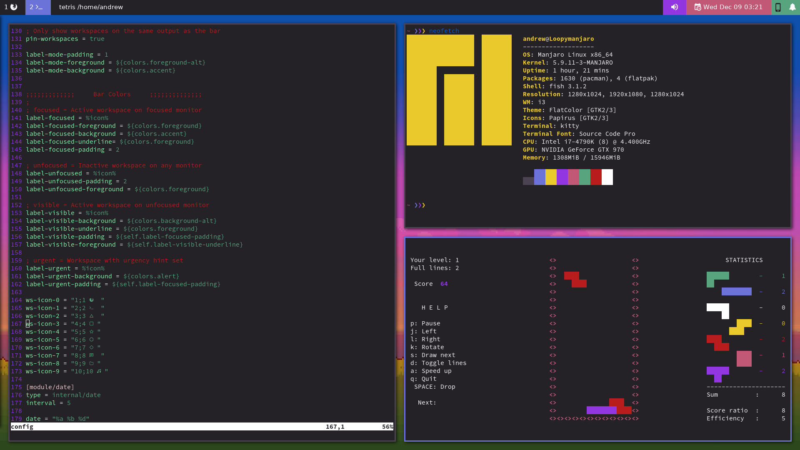

# NimbleClint's Dotfiles
## i3-Gaps and Polybar

### Installation Notes
Welcome to my i3/polybar configuration. Please note that these files are not logner being updated and are provided as is. Some rofi files are missing but there is a link below on where to grab them. Everything else should be there, but will likely need some tweaking to get working.

WPGTK has been used to manage several of the files, such as the rofi menus, dunst, and i3 itself. These files have warning up top to indicate that they should be modified by editing the WPGTK template rather than the .config file.

### Apps Used
Desktop Environment |
---- |
i3-Gaps |
Polybar |
Dunst |
Rofi |
[Ibhagwom's Picom](https://github.com/ibhagwan/picom) |
WPGTK |
Feh |

Command Line Interface |
---- |
Fish |
Kitty |

Polybar |
---- |
[Polybar-KDEconnect](https://github.com/haideralipunjabi/polybar-kdeconnect) (modified and included) |
[Dunst-Polybar](https://github.com/JeanEdouardKevin/dunst-polybar) (Included) |
[Popup-Calendar](https://github.com/polybar/polybar-scripts/tree/master/polybar-scripts/popup-calendar) (Included) |

Rofi Menus |
---- |
[Rofi Applets](https://github.com/adi1090x/rofi)
(Powermenu included, launcher not included) |

Fonts |
---- |
Any Nerd Font
Font Awesome 5
DejaVu Sans/DejaVu Sans mono
Terminal font: Source Code Pro

### Wallpaper
Cudos to artist: [Pixel art by AbyssWolf](https://www.deviantart.com/abysswolf/art/Finn-and-Jake-382050723)  
I don't know who made the wallpaper [but you can find it here.](https://cdn.wallpapersafari.com/88/29/AJvlRT.jpg)

## More Delicious Rice
This config is no longer being updated. To see my current desktop configuration, check out [my current dotfiles.](https://github.com/NimbleClint/dotfiles)
